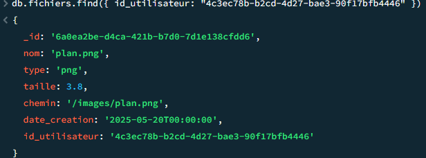
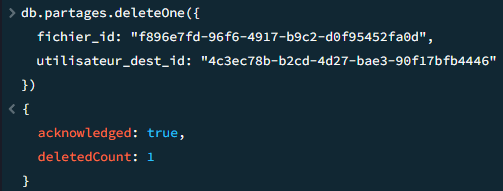
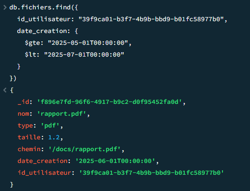
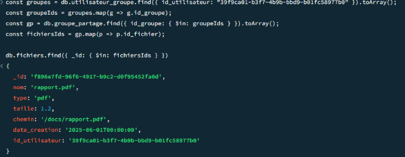
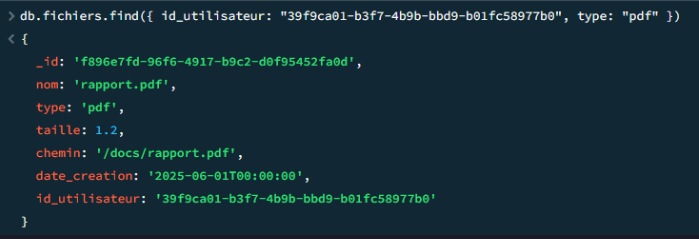
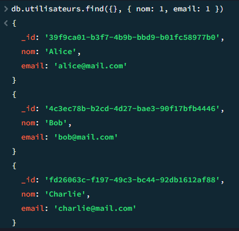

## <span style="color:rgb(0, 176, 240)">1. Quels sont les fichiers que j’ai téléchargés ?</span>

```sql
db.fichiers.find({ id_utilisateur: "4c3ec78b-b2cd-4d27-bae3-90f17bfb4446" })
```



## <span style="color:rgb(0, 176, 240)">2. Avec qui ai-je partagé mes fichiers ?</span>

```sql
const mesFichiers = db.fichiers.find({ id_utilisateur: "4c3ec78b-b2cd-4d27-bae3-90f17bfb4446" }).toArray();
const ids = mesFichiers.map(f => f._id);
db.partages.find({ fichier_id: { $in: ids } })
```


## <span style="color:rgb(0, 176, 240)">3. Quels fichiers ont été partagés avec moi ?</span>

```sql
const partages = db.partages.find({ utilisateur_dest_id: "4c3ec78b-b2cd-4d27-bae3-90f17bfb4446" }).toArray();
const fichiersIds = partages.map(p => p.fichier_id);
db.fichiers.find({ _id: { $in: fichiersIds } })
```


## <span style="color:rgb(0, 176, 240)">4. Puis-je retirer l’accès d’un utilisateur à un fichier ?</span>

```sql
db.partages.deleteOne({
  fichier_id: "f896e7fd-96f6-4917-b9c2-d0f95452fa0d",
  utilisateur_dest_id: "4c3ec78b-b2cd-4d27-bae3-90f17bfb4446"
})
```



## <span style="color:rgb(0, 176, 240)">5. Quels sont les fichiers que je peux modifier ?</span>

```sql
const partages = db.partages.find({
  utilisateur_dest_id: "fd26063c-f197-49c3-bc44-92db1612af88",
  droit_ecriture: true
}).toArray();

const fichiersIds = partages.map(p => p.fichier_id);
db.fichiers.find({ _id: { $in: fichiersIds } })
```


## <span style="color:rgb(0, 176, 240)">6. Quel est le type de fichier le plus fréquent dans mon espace ?</span>

```sql
db.fichiers.aggregate([
  { $group: { _id: "$type", total: { $sum: 1 } } },
  { $sort: { total: -1 } }
- [ ] ])
```


## <span style="color:rgb(0, 176, 240)">7. Combien d’espace j’ai utilisé en Mo ?</span>

```sql
db.fichiers.aggregate([
  { $match: { id_utilisateur: "39f9ca01-b3f7-4b9b-bbd9-b01fc58977b0" }},
  { $group: { _id: null, totalMo: { $sum: "$taille" }}}
])
```


## <span style="color:rgb(0, 176, 240)">8. Quels sont les fichiers créés ce mois-ci ?</span>

```sql
db.fichiers.find({
  id_utilisateur: "39f9ca01-b3f7-4b9b-bbd9-b01fc58977b0",
  date_creation: {
    $gte: "2025-05-01T00:00:00",
    $lt: "2025-07-01T00:00:00"
  }
})
```



## <span style="color:rgb(0, 176, 240)">9. Quels utilisateurs font partie de mon groupe de travail ?</span>

```sql
const groupes = db.utilisateur_groupe.find({ id_utilisateur: "39f9ca01-b3f7-4b9b-bbd9-b01fc58977b0" }).toArray();
const groupeIds = groupes.map(g => g.id_groupe);

db.utilisateur_groupe.find({
  id_groupe: { $in: groupeIds },
  id_utilisateur: { $ne: "4c3ec78b-b2cd-4d27-bae3-90f17bfb4446" }
})
```


## <span style="color:rgb(0, 176, 240)">10. Quels fichiers sont partagés avec mon groupe ?</span>

```sql
const groupes = db.utilisateur_groupe.find({ id_utilisateur: "39f9ca01-b3f7-4b9b-bbd9-b01fc58977b0" }).toArray();
const groupeIds = groupes.map(g => g.id_groupe);
const gp = db.groupe_partage.find({ id_groupe: { $in: groupeIds } }).toArray();
const fichiersIds = gp.map(p => p.id_fichier);

db.fichiers.find({ _id: { $in: fichiersIds } })
```



## <span style="color:rgb(0, 176, 240)">11. Puis-je filtrer mes fichiers par type (PDF, JPG, etc.) ?</span>

```sql
db.fichiers.find({ id_utilisateur: "39f9ca01-b3f7-4b9b-bbd9-b01fc58977b0", type: "pdf" })
```



## <span style="color:rgb(0, 176, 240)">12. Quels sont tous les fichiers présents dans la base ?</span>

```sql
db.fichiers.find({})
```


## <span style="color:rgb(0, 176, 240)">1<span style="color:rgb(0, 176, 240)">3. </span>Combien y a-t-il de fichiers au total ?</span>

```sql
db.fichiers.countDocuments()
```


## <span style="color:rgb(0, 176, 240)">14. Combien y a-t-il de fichiers au total ?</span>

```sql
db.utilisateurs.find({}, { nom: 1, email: 1 })
```




python api.py
python -m streamlit run interface.py

pip install matplotlib
pip install seaborn
pip install pandas
pip install streamlit
pip install pymongo
pip install flask