# Comment l'Utiliser 

## Librairie a installer

### matplotlib
```bash
pip install matplotlib
```

### seaborn
```bash
pip install seaborn
```

### pandas
```bash
pip install pandas
```

### streamlit
```bash
pip install streamlit
```

### pymongo
```bash
pip install pymongo
```

### flask
```bash
pip install flask
```

## Commmende de démarrage

API
```bash
python api.py
```

Interface
```bash
python -m streamlit run interface.py
```

# Questions utilisateurs & Requêtes MongoDB

## <span style="color:rgb(0, 176, 240)">1. Quels sont les fichiers que j’ai téléchargés ?</span>

```sql
db.fichiers.find({ id_utilisateur: "bc98031b-9dfc-4bcc-80cf-aa767eb86b9f" })
```

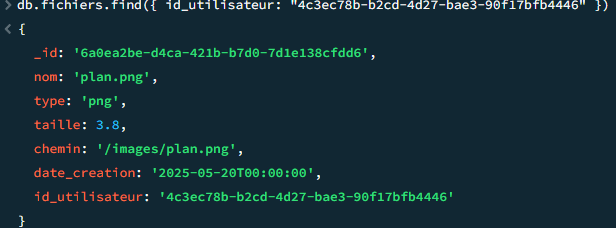

## <span style="color:rgb(0, 176, 240)">2. Avec qui ai-je partagé mes fichiers ?</span>

```sql
const mesFichiers = db.fichiers.find({ id_utilisateur: "bc98031b-9dfc-4bcc-80cf-aa767eb86b9f" }).toArray();
const ids = mesFichiers.map(f => f._id);
db.partages.find({ fichier_id: { $in: ids } })
```

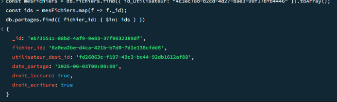

## <span style="color:rgb(0, 176, 240)">3. Quels fichiers ont été partagés avec moi ?</span>

```sql
const partages = db.partages.find({ utilisateur_dest_id: "7d44f347-6031-4087-a227-74be3090a8e7" }).toArray();
const fichiersIds = partages.map(p => p.fichier_id);
db.fichiers.find({ _id: { $in: fichiersIds } })
```

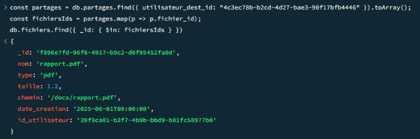

## <span style="color:rgb(0, 176, 240)">4. Puis-je retirer l’accès d’un utilisateur à un fichier ?</span>

```sql
db.partages.deleteOne({
  fichier_id: "a580bdbf-f932-4789-be72-5cbdb7e4a582",
  utilisateur_dest_id: "bc98031b-9dfc-4bcc-80cf-aa767eb86b9f"
})
```

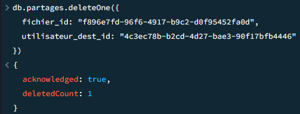

## <span style="color:rgb(0, 176, 240)">5. Quels sont les fichiers que je peux modifier ?</span>

```sql
const partages = db.partages.find({
  utilisateur_dest_id: "7d44f347-6031-4087-a227-74be3090a8e7",
  droit_ecriture: true
}).toArray();

const fichiersIds = partages.map(p => p.fichier_id);
db.fichiers.find({ _id: { $in: fichiersIds } })
```

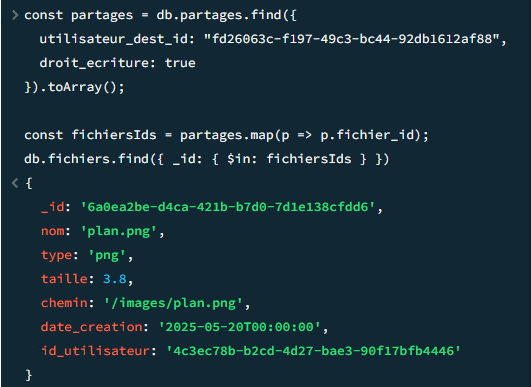

## <span style="color:rgb(0, 176, 240)">6. Quel est le type de fichier le plus fréquent dans mon espace ?</span>

```sqldb.fichiers.aggregate([
  { $match: { id_utilisateur: "14d2cb91-3b95-46eb-849c-4bd5f93dbeb8" } },
  { $group: { _id: "$type", count: { $sum: 1 } } },
  { $sort: { count: -1 } },
  { $limit: 1 }
])
```

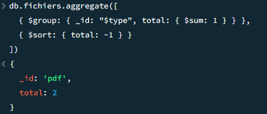

## <span style="color:rgb(0, 176, 240)">7. Combien d’espace j’ai utilisé en Mo ?</span>

```sql
db.fichiers.aggregate([
  { $match: { id_utilisateur: "bc98031b-9dfc-4bcc-80cf-aa767eb86b9f" }},
  { $group: { _id: null, totalMo: { $sum: "$taille" }}}
])
```

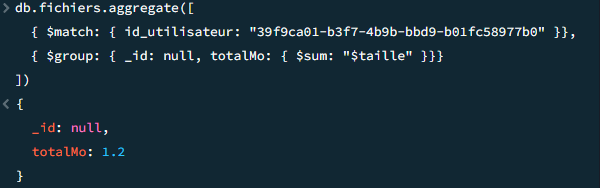

## <span style="color:rgb(0, 176, 240)">8. Quels sont les fichiers créés ce mois-ci ?</span>

```sql
db.fichiers.find({
  id_utilisateur: "bc98031b-9dfc-4bcc-80cf-aa767eb86b9f",
  date_creation: {
    $gte: "2025-05-01T00:00:00",
    $lt: "2025-07-01T00:00:00"
  }
})
```

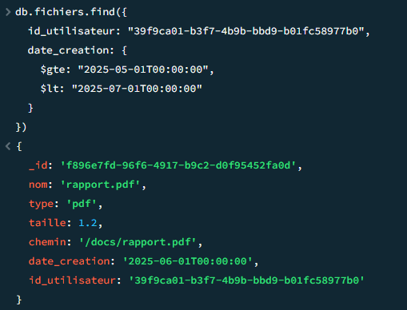

## <span style="color:rgb(0, 176, 240)">9. Quels utilisateurs font partie de mon groupe de travail ?</span>

```sql
const groupes = db.utilisateur_groupe.find({ id_utilisateur: "3973d71f-8593-4933-8826-046b3d3a44dd" }).toArray();
const groupeIds = groupes.map(g => g.id_groupe);

db.utilisateur_groupe.find({
  id_groupe: { $in: groupeIds },
  id_utilisateur: { $ne: "85aafaef-9671-4363-a2f7-626d5c378d3e" }
})
```

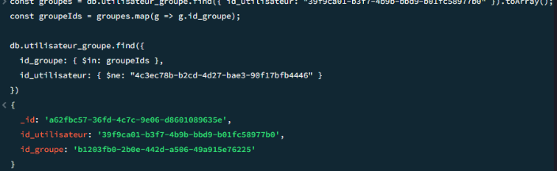

## <span style="color:rgb(0, 176, 240)">10. Quels fichiers sont partagés avec mon groupe ?</span>

```sql
const groupes = db.utilisateur_groupe.find({ id_utilisateur: "85aafaef-9671-4363-a2f7-626d5c378d3e" }).toArray();
const groupeIds = groupes.map(g => g.id_groupe);
const gp = db.groupe_partage.find({ id_groupe: { $in: groupeIds } }).toArray();
const fichiersIds = gp.map(p => p.id_fichier);

db.fichiers.find({ _id: { $in: fichiersIds } })
```

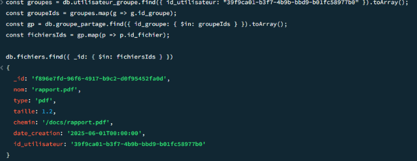

## <span style="color:rgb(0, 176, 240)">11. Puis-je filtrer mes fichiers par type (PDF, JPG, etc.) ?</span>

```sql
db.fichiers.find({ id_utilisateur: "420a9ba3-12d4-4b04-89bb-a553829789a2", type: "pdf" })
```

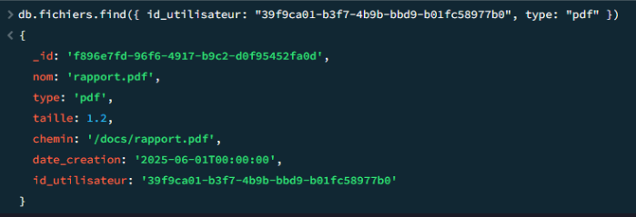

## <span style="color:rgb(0, 176, 240)">12. Quels sont tous les fichiers présents dans la base ?</span>

```sql
db.fichiers.find({})
```
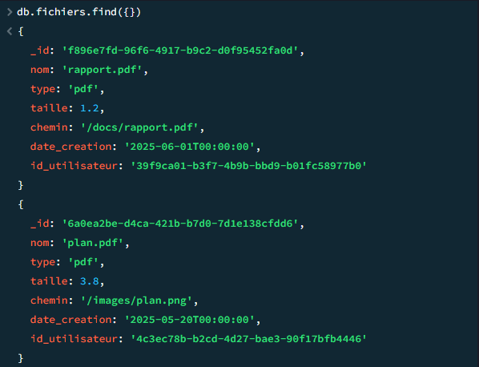

## <span style="color:rgb(0, 176, 240)">1<span style="color:rgb(0, 176, 240)">3. </span>Combien y a-t-il de fichiers au total ?</span>

```sql
db.fichiers.countDocuments()
```

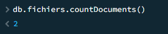

## <span style="color:rgb(0, 176, 240)">14. Combien y a-t-il de fichiers au total ?</span>

```sql
db.utilisateurs.find({}, { nom: 1, email: 1 })
```

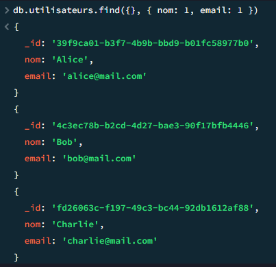
